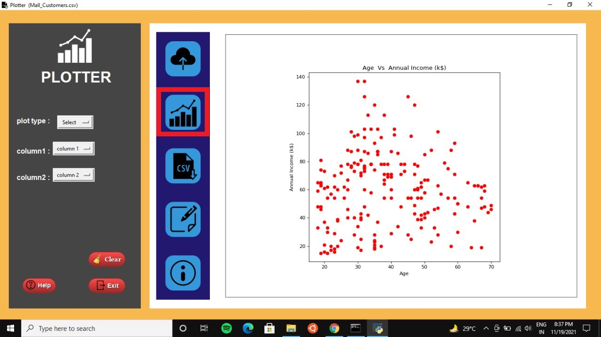
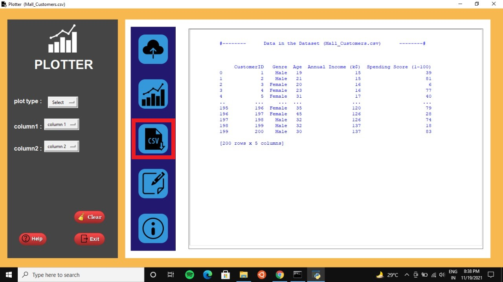
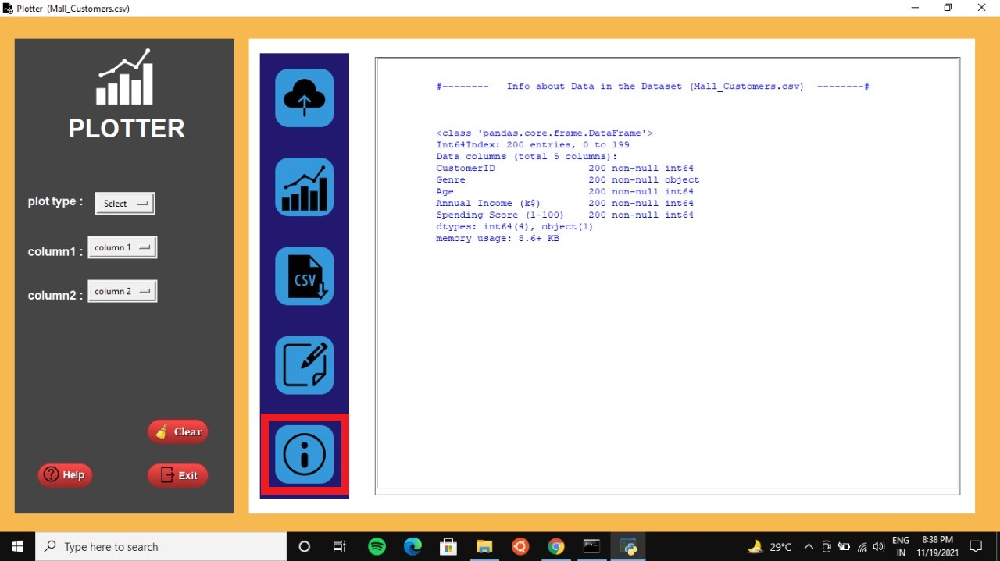

# PLOTTER

 Plotter is a python GUI application built using **tkinter** module .
It enables user to select a **.csv** dataset from local file directories
and provides a feature to plot data from selected set using 3
different plot types.
It also provides some basic features to fetch useful information
from dataset.

---
## Contents
- [Getting Started](#getting-started)
- [How to run the project?](#how-to-run-the-project)
- [Create symbolic link to the executable file](#Create-symbolic-link-to-the-executable-file)
- [ A Note about ```/``` for Windows Users](#A-Note-about-/-for-Windows-Users)
- [Usage](#usage)
- [Contributing](#🤝contributing)
---
## Getting Started

### Pre-requisites
You need to have following installed on your computer:

### 1. Install Python: 
Python is usually installed by default on most modern systems. To check what python version you currently have, open a terminal and run the following command:
```
python --version
```

   This should output some information on the installed Python version. You can also install python by following these instructions:
   [https://installpython3.com/](https://wsvincent.com/install-python/)

### 2. Install Required Python Packages:
   Before running the project you should have all the required python packages 
   installed on your system.Incase if you don't have a package installed and after running the project you get a error as follows
   ```
   No module named < Module-Name > 
   ```

then you can resolve this error by installing the required package by running following command in command prompt or terminal:
```
pip install < Module-Name > 
```


***
 
 ## How to run the project?
 Download this project on your system.

 1.You should be able to execute the plotter app by running the following command from the terminal.

**On Windows:**
 ```
 .\plotter.bat
 ```
 **On Unix:**
 ```
 ./plotter.sh
 ```
***

## Create symbolic link to the executable file
**On Windows**
To create a symbolic link on Windows, you'll need to run either the Windows Command Prompt, or Windows Powershell **with administrator privileges.** To do so, right-click on the icon for Command Prompt, or Powershell, and choose the **"Run as Administrator"** option.

**Command Prompt:**
```
> mklink plotter plotter.bat
```
**Powershell:**
```
> cmd /c mklink plotter plotter.bat
```

**On Linux/Unix:**

Run the following command in your shell:

```
$ ln -s plotter.sh plotter
```
 
 ***

 ## A Note about ```/``` for Windows Users

  You'll see many commands prefixed with ```./```, or paths containing the ```/``` (forward-slash) character.

If you're using the Windows Command Prompt, then you'll need to replace ```/``` with ```\``` (back-slash) for these commands and paths to work as expected.

On Windows Powershell, these substitutions are not required.
 
 ***
    
 ## Usage

 You need to click on the buttons highlighted in the following pictures to perform the mentioned operations.

 ### 1.Selecting a CSV Dataset
 
 
 ### 2.Selecting a CSV Dataset
 

 ### 3.Plot the data
 

 ### 4.Display data from chosen dataset
 

 ### 5.Display description of numerical data from chosen dataset
 

 ### 6.Display information about chosen dataset
 


 
***

## 🤝Contributing
contributions and feature requests are welcome.

1. **Fork** the repo on GitHub.
2. **Clone** the project to your own machine.
3. **Commit** changes to **master** branch.
4. **Push** your work back up to your fork.
5. Submit a **Pull request** so that I can review your changes.


---
## Show your support

Give a ⭐ if you found this project useful.

[](https://github.com/ellerbrock/open-source-badges/)

---